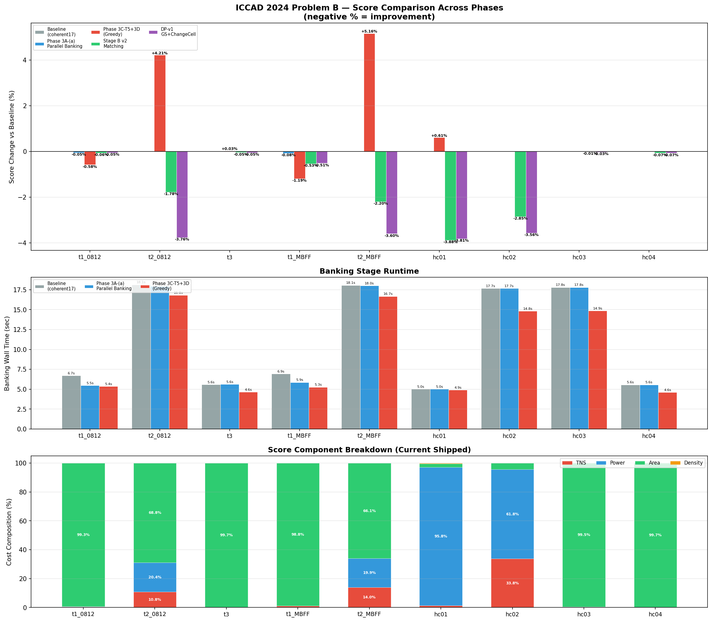
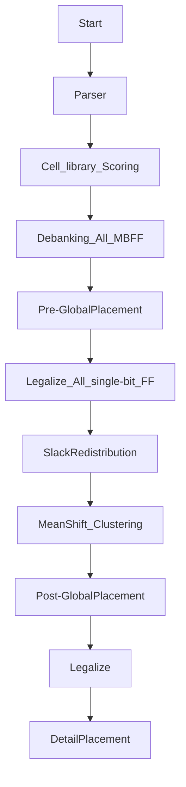

# 2024 ICCAD Problem B — MBFF Banking & Placement

> Fork of [coherent17's solution](https://github.com/coherent17/2024-ICCAD-Problem-B), extended with parallel banking, slack-aware cost infrastructure, and thesis research (Method D: Slack Redistribution + Max-Weight Matching).

---

## Performance Comparison



### Score Table (lower = better)

| Testcase | Baseline | Stage B v2 (Matching) | **Current (DP-v1)** | Delta vs Baseline | Dominant Cost |
|---|---:|---:|---:|---:|---|
| testcase1_0812 | 743,005,833 | 742,555,934 | **742,639,817** | **-0.05%** | Area 99% |
| testcase2_0812 | 830,273 | 815,494 | **799,037** | **-3.76%** | TNS 11% / Power 20% / Area 69% |
| testcase3 | 728,870,766 | 728,538,922 | **728,524,849** | **-0.05%** | Area 100% |
| testcase1_MBFF | 752,479,215 | 748,465,219 | **748,608,496** | **-0.49%** | Area 99% |
| testcase2_MBFF | 865,419 | 846,400 | **834,278** | **-3.60%** | TNS 14% / Power 20% / Area 66% |
| hiddencase01 | 32,732,137 | 31,462,728 | **31,484,870** | **-3.81%** | **Power 96%** |
| hiddencase02 | 13,863,364 | 13,468,811 | **13,369,311** | **-3.56%** | **TNS 34% / Power 62%** |
| hiddencase03 | 55,941,538 | 55,934,849 | **55,925,777** | **-0.03%** | Area 100% |
| hiddencase04 | 729,383,529 | 728,875,222 | **728,870,559** | **-0.07%** | Area 100% |

> Current shipped version: Stage B v2 matching + DP-v1 (cost-aware GlobalSwap + ChangeCell). Largest gains on TNS/Power cases: t2_0812 **-3.76%**, t2_MBFF **-3.60%**, hc01 **-3.81%**, hc02 **-3.56%**.

### Banking Wall Time

| Testcase | Baseline | Current Shipped | Delta |
|---|---:|---:|---:|
| testcase1_0812 | 6.7s | **5.4s** | **-20%** |
| testcase2_0812 | 18.1s | **16.8s** | **-7%** |
| testcase3 | 5.6s | **4.6s** | **-17%** |
| testcase1_MBFF | 6.9s | **5.3s** | **-24%** |
| testcase2_MBFF | 18.1s | **16.7s** | **-8%** |
| hiddencase01 | 5.0s | **4.9s** | **-2%** |
| hiddencase02 | 17.7s | **14.8s** | **-16%** |
| hiddencase03 | 17.8s | **14.9s** | **-17%** |
| hiddencase04 | 5.6s | **4.6s** | **-17%** |

---

## Shipped Improvements

| Phase | Date | Change | Key Metric |
|---|---|---|---|
| 1.5 | 2026-04-13 | Disable mid-stage evaluator fork | Wall time **-29% to -65%** |
| 3A-(a) | 2026-04-15 | Per-clkIDX parallel banking + thread-0 canonical reuse | Banking **-15~18%**, score -0.05~-0.08% |
| 3C-T5 | 2026-04-16 | Bucketed parallel SliceRowsByGate | preLegalize **-13~15%**, banking **-7~18%** |
| 3D-A | 2026-04-16 | Slack redistribution infra (experimental, env knob) | Infrastructure only; `SLACK_REDIST_MODE=0` default |
| B-v1 | 2026-04-16 | LEMON max-weight matching for 2-bit banking | hc01 -3.88%, t2_0812 -2.24%, t2_MBFF -2.16% |
| B-v2 | 2026-04-17 | Proximity-bonus edge weighting for matching | t3 -0.05%, hc03 -0.01% (minor tuning) |
| **DP-v1** | 2026-04-17 | **Cost-aware GlobalSwap + enable ChangeCell** | **t2_0812 -2.02%, t2_MBFF -1.43%, hc02 -0.74% (vs B-v2)** |

---

## Thesis Direction: Method D

**Slack Redistribution + Max-Weight Matching for Timing-Constrained MBFF Banking**

- **Stage A** (shipped): Redistribute D-pin slack along timing paths to per-FF budgets
- **Stage B v2** (shipped): LEMON MaxWeightedMatching for pairwise 2-bit banking; greedy 4-bit+ fallback; proximity-bonus edge weighting
- **DP-v1** (shipped): Cost-aware GlobalSwap (getCost() acceptance) + ChangeCell (OMP race fix)
- **Stage C** (planned): Iterative 2-bit -> 4-bit -> 8-bit extension (v2 attempted, hc01 regression — needs skip logic)
- **Stage D** (planned): Critical-FF rescue pass

---

## Flow



## Usage

Install Boost Package
```
$ sudo apt-get install libboost-all-dev
$ make boost
```

Compile
```
$ make or make -j
```

Run testcase
```
$ make run1
$ make run2
$ make run3
$ make run4
$ make run5
```

Run with LEMON matching banking (Stage B)
```
$ BANKING_MODE=matching PRODUCTION=1 make run1
```

Run with slack redistribution (experimental)
```
$ SLACK_REDIST_MODE=1 SLACK_OVERSHOOT_WEIGHT=1.0 make run1
```

Update performance chart
```
$ python3 ../scripts/plot_score_comparison.py
```
