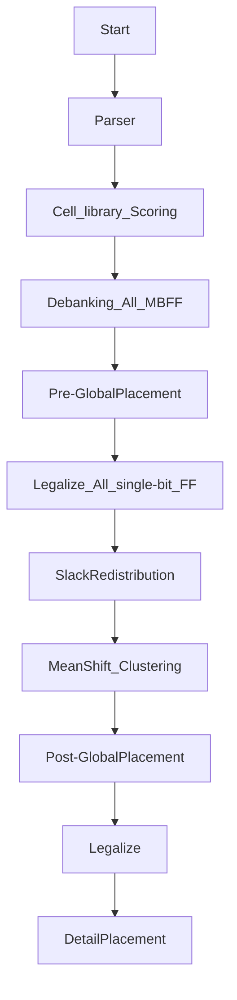

# 2024 ICCAD Problem B — MBFF Banking & Placement

> Fork of [coherent17's solution](https://github.com/coherent17/2024-ICCAD-Problem-B), extended with parallel banking, slack-aware cost infrastructure, and thesis research (Method D: Slack Redistribution + Max-Weight Matching).

---

## Performance Comparison


### Best Results vs ICCAD 2024 Contest Top-3

> **Reference** = best score among the three top contest teams per case (ICCAD 2024 contest results). **Lower = better. Bold = beats the contest best.**
> **Ours** = base banking (LEMON max-weight matching + adaptive cost) **plus** env-gated post-legalization refinement: RELOC + CRIT_SWAP + BIT_REPAIR scored by a faithful incremental-STA engine, with cone-disjoint dynasearch. Per-case best engine (serial vs dynasearch). All scores from the real `preliminary-evaluator`, all legal (`Check pass`). Run: `BANKING_MODE=matching PRODUCTION=1 INCR_RELOC=1 RELOC=1 CRIT_SWAP=1 BIT_REPAIR=1 BIT_REPAIR_DYNA=1` (+ per-stage budgets; refinement gates default-off byte-exact).

| Testcase | Contest top-3 best | **Ours** | Δ | β |
|---|---:|---:|---:|---:|
| testcase1_0812 | 739,200,000 | **735,461,390** | **−0.51%** | 2000 |
| testcase2_0812 | 748,000 | **743,940** | **−0.54%** | 400 |
| testcase3 | 729,300,000 | **727,140,578** | **−0.30%** | 10000 |
| hiddencase01 | 31,510,000 | **30,281,151** | **−3.90%** | 200000 |
| hiddencase02 | 13,280,000 | **11,099,145** | **−16.42%** | 40000 |
| hiddencase03 | 55,940,000 | **55,846,482** | **−0.17%** | 400 |
| hiddencase04 | 728,700,000 | **727,191,554** | **−0.21%** | 10000 |

> **Beats the ICCAD 2024 contest top-3 (best entry per case) on all 7 cases.** tc2 (β=400, the hardest) is still being optimized — 743,940 here (extended budget); 747,324 at the standard 600 s budget, both below the 748,000 contest best. Largest lead: hc02 −16.42%.

### Historical Per-Phase Scores (lower = better)

| Testcase | Baseline | Stage B v2 | DP-v2 | Pin-offset | Adaptive DIST_BONUS | **Current (2026-06-15, best)** |
|---|---:|---:|---:|---:|---:|---:|
| testcase1_0812 | 743,005,833 | 742,555,934 | 741,282,699 | 740,426,488 | 740,715,329 | **735,461,390** |
| testcase2_0812 | 830,273 | 815,494 | 799,642 | 772,711 | 771,385 | **743,940** |
| testcase3 | 728,870,766 | 728,538,922 | 728,181,612 | 728,677,742 | 728,292,737 | **727,140,578** |
| hiddencase01 | 32,732,137 | 31,462,728 | 31,239,556 | 31,070,005 | 31,108,205 | **30,281,151** |
| hiddencase02 | 13,863,364 | 13,468,811 | 12,589,252 | 12,325,446 | 12,056,721 | **11,099,145** |
| hiddencase03 | 55,941,538 | 55,934,849 | 55,917,540 | 55,860,767 | 55,866,361 | **55,846,482** |
| hiddencase04 | 729,383,529 | 728,875,222 | 728,590,247 | 728,289,561 | 728,299,384 | **727,191,554** |

### Banking Wall Time

| Testcase | Baseline | Current Shipped | Delta |
|---|---:|---:|---:|
| testcase1_0812 | 6.7s | **5.4s** | **-20%** |
| testcase2_0812 | 18.1s | **16.8s** | **-7%** |
| testcase3 | 5.6s | **4.6s** | **-17%** |
| testcase1_MBFF | 6.9s | **5.3s** | **-24%** |
| testcase2_MBFF | 18.1s | **16.7s** | **-8%** |
| hiddencase01 | 5.0s | **4.9s** | **-2%** |
| hiddencase02 | 17.7s | **14.8s** | **-16%** |
| hiddencase03 | 17.8s | **14.9s** | **-17%** |
| hiddencase04 | 5.6s | **4.6s** | **-17%** |

---

## Shipped Improvements

| Phase | Date | Change | Key Metric |
|---|---|---|---|
| 1.5 | 2026-04-13 | Disable mid-stage evaluator fork | Wall time **-29% to -65%** |
| 3A-(a) | 2026-04-15 | Per-clkIDX parallel banking + thread-0 canonical reuse | Banking **-15~18%**, score -0.05~-0.08% |
| 3C-T5 | 2026-04-16 | Bucketed parallel SliceRowsByGate | preLegalize **-13~15%**, banking **-7~18%** |
| 3D-A | 2026-04-16 | Slack redistribution infra (experimental, env knob) | Infrastructure only; `SLACK_REDIST_MODE=0` default |
| B-v1 | 2026-04-16 | LEMON max-weight matching for 2-bit banking | hc01 -3.88%, t2_0812 -2.24%, t2_MBFF -2.16% |
| B-v2 | 2026-04-17 | Proximity-bonus edge weighting for matching | t3 -0.05%, hc03 -0.01% (minor tuning) |
| DP-v1 | 2026-04-17 | Cost-aware GlobalSwap + enable ChangeCell | t2_0812 -2.02%, t2_MBFF -1.43%, hc02 -0.74% (vs B-v2) |
| DP-v2 | 2026-04-17 | K=5 nearest GlobalSwap | hc02 -5.84%, hc01 -0.78%, t2_MBFF -0.81% (vs DP-v1) |
| Per-pin | 2026-04-17 | Per-pin CostCompare: driver/load HPWL + max(0,-slack) TNS filter | t2_0812 -1.7%, hc02 -0.9% (vs old CostCompare, no DP) |
| DP-v3 | 2026-04-17 | Iterative GS+CC with RtreeMap rebuild (fix DP-v2 stale rtree bug) | t2_0812 -1.40%, t2_MBFF -1.88%, hc02 -0.91% (vs DP-v2) |
| Pin-offset | 2026-04-17 | Fix CostCompare: use target cell pin offsets instead of cell origin | t2_0812 -1.99%, hc02 -1.20% (vs per-pin without fix) |
| Adaptive DIST_BONUS | 2026-04-18 | Per-edge adaptive DIST_BONUS: zero bonus for neg-slack pairs, THRESH=20 | hc02 -2.18%, t2_MBFF -1.25%, t2_0812 -0.17% (vs pin-offset) |
| DP_SLOT_ASSIGN | 2026-04-20 | DetailAssignmentMBFF intra-only Hungarian as default | **strict 7-case win**: tc2 -0.189%, hc02 -0.791%, others -0.004~0 |
| **Adaptive MATCH_K** | 2026-04-20 | **Banking MATCH_K=8 when β≤500, else 15 (β is the discriminator)** | **tc2 -0.997%, hc03 +0.019% noise, 5 cases byte-exact** |

---

## Thesis Direction: Method D

**Slack Redistribution + Max-Weight Matching for Timing-Constrained MBFF Banking**

- **Stage A** (shipped): Redistribute D-pin slack along timing paths to per-FF budgets
- **Stage B v2** (shipped): LEMON MaxWeightedMatching for pairwise 2-bit banking; greedy 4-bit+ fallback; proximity-bonus edge weighting
- **Per-pin CostCompare + pin-offset fix** (shipped): Direction-aware per-pin D/Q HPWL with correct target cell pin offsets + max(0,-slack) TNS filter
- **DP-v3** (shipped): Iterative GlobalSwap+ChangeCell with RtreeMap rebuild after cell type changes
- **ComputeOptimalPosition** (implemented, not active): Slack-weighted median of driver/load positions; tested but doesn't improve 2-bit matching (pre-placement already near-optimal)
- **Stage C** (planned): Iterative 2-bit -> 4-bit -> 8-bit extension (v2 attempted, hc01 regression — needs skip logic)
- **Stage D** (planned): Critical-FF rescue pass

---

## Flow



## Usage

Install Boost Package
```
$ sudo apt-get install libboost-all-dev
$ make boost
```

Compile
```
$ make or make -j
```

Run testcase
```
$ make run1
$ make run2
$ make run3
$ make run4
$ make run5
```

Run with LEMON matching banking (Stage B)
```
$ BANKING_MODE=matching PRODUCTION=1 make run1
```

Run with slack redistribution (experimental)
```
$ SLACK_REDIST_MODE=1 SLACK_OVERSHOOT_WEIGHT=1.0 make run1
```

Update performance chart
```
$ python3 ../scripts/plot_score_comparison.py
```
