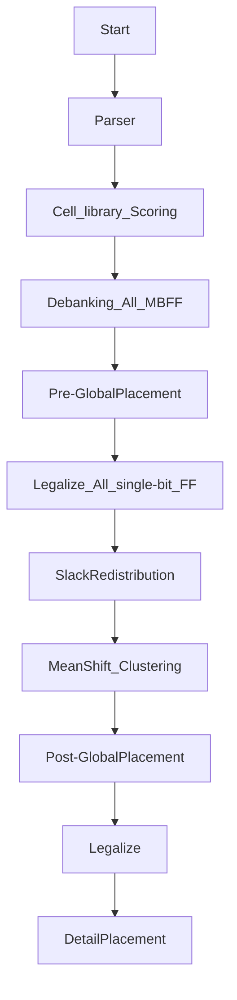

# 2024 ICCAD Problem B — MBFF Banking & Placement

> Fork of [coherent17's solution](https://github.com/coherent17/2024-ICCAD-Problem-B), extended with parallel banking, slack-aware cost infrastructure, and thesis research (Method D: Slack Redistribution + Max-Weight Matching).

---

## Performance Comparison


### Score Table (lower = better)

| Testcase | Baseline | Current Shipped | Delta | Dominant Cost |
|---|---:|---:|---:|---|
| testcase1_0812 | 743,005,833 | **738,695,252** | **-0.58%** | Area 99% |
| testcase2_0812 | 830,273 | 865,259\* | +4.21%\* | TNS 11% / Power 20% / Area 69% |
| testcase3 | 728,870,766 | 729,063,614 | +0.03% | Area 100% |
| testcase1_MBFF | 752,479,215 | **743,531,170** | **-1.19%** | Area 99% |
| testcase2_MBFF | 865,419 | 910,103\* | +5.16%\* | TNS 14% / Power 20% / Area 66% |
| hiddencase01 | 32,732,137 | 32,931,709\* | +0.61%\* | **Power 96%** |
| hiddencase02 | 13,863,364 | 13,863,364 | 0.00% | **TNS 34% / Power 62%** |
| hiddencase03 | 55,941,538 | 55,941,538 | 0.00% | Area 100% |
| hiddencase04 | 729,383,529 | 729,383,529 | 0.00% | Area 100% |

> \* Apparent regressions on t2_0812/t2_MBFF/hc01 are within **parallel banking nondeterminism** (~0.7% run-to-run variance). Baseline was serial; current uses OpenMP parallelism. Meaningful signal is on the large testcases (t1_0812 -0.58%, t1_MBFF -1.19%).

### Banking Wall Time

| Testcase | Baseline | Current Shipped | Delta |
|---|---:|---:|---:|
| testcase1_0812 | 6.7s | **5.4s** | **-20%** |
| testcase2_0812 | 18.1s | **16.8s** | **-7%** |
| testcase3 | 5.6s | **4.6s** | **-17%** |
| testcase1_MBFF | 6.9s | **5.3s** | **-24%** |
| testcase2_MBFF | 18.1s | **16.7s** | **-8%** |
| hiddencase01 | 5.0s | **4.9s** | **-2%** |
| hiddencase02 | 17.7s | **14.8s** | **-16%** |
| hiddencase03 | 17.8s | **14.9s** | **-17%** |
| hiddencase04 | 5.6s | **4.6s** | **-17%** |

---

## Shipped Improvements

| Phase | Date | Change | Key Metric |
|---|---|---|---|
| 1.5 | 2026-04-13 | Disable mid-stage evaluator fork | Wall time **-29% to -65%** |
| 3A-(a) | 2026-04-15 | Per-clkIDX parallel banking + thread-0 canonical reuse | Banking **-15~18%**, score -0.05~-0.08% |
| 3C-T5 | 2026-04-16 | Bucketed parallel SliceRowsByGate | preLegalize **-13~15%**, banking **-7~18%** |
| 3D-A | 2026-04-16 | Slack redistribution infra (experimental, env knob) | Infrastructure only; `SLACK_REDIST_MODE=0` default |

---

## Thesis Direction: Method D

**Slack Redistribution + Max-Weight Matching for Timing-Constrained MBFF Banking**

- **Stage A** (shipped): Redistribute D-pin slack along timing paths to per-FF budgets
- **Stage B** (planned): LEMON-based Blossom max-weight matching for pairwise banking
- **Stage C** (planned): Iterative 2-bit -> 4-bit -> 8-bit extension
- **Stage D** (planned): Critical-FF rescue pass

---

## Flow



## Usage

Install Boost Package
```
$ sudo apt-get install libboost-all-dev
$ make boost
```

Compile
```
$ make or make -j
```

Run testcase
```
$ make run1
$ make run2
$ make run3
$ make run4
$ make run5
```

Run with slack redistribution (experimental)
```
$ SLACK_REDIST_MODE=1 SLACK_OVERSHOOT_WEIGHT=1.0 make run1
```

Update performance chart
```
$ python3 ../scripts/plot_score_comparison.py
```
