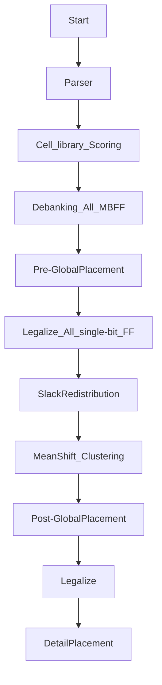

# 2024 ICCAD Problem B — MBFF Banking & Placement

> Fork of [coherent17's solution](https://github.com/coherent17/2024-ICCAD-Problem-B), extended with parallel banking, slack-aware cost infrastructure, and thesis research (Method D: Slack Redistribution + Max-Weight Matching).

---

## Performance Comparison


### Score Table (lower = better)

| Testcase | Baseline | Stage B v2 | DP-v2 | **Current (Per-pin + DP-v3)** | Delta vs Baseline | Dominant Cost |
|---|---:|---:|---:|---:|---:|---|
| testcase1_0812 | 743,005,833 | 742,555,934 | 741,282,699 | **740,574,007** | **-0.33%** | Area 99% |
| testcase2_0812 | 830,273 | 815,494 | 799,642 | **788,429** | **-5.04%** | TNS 11% / Power 20% / Area 69% |
| testcase3 | 728,870,766 | 728,538,922 | 728,181,612 | **728,505,556** | -0.05% | Area 100% |
| testcase1_MBFF | 752,479,215 | 748,465,219 | 745,999,703 | **747,776,903** | -0.62% | Area 99% |
| testcase2_MBFF | 865,419 | 846,400 | 827,535 | **811,985** | **-6.17%** | TNS 14% / Power 20% / Area 66% |
| hiddencase01 | 32,732,137 | 31,462,728 | 31,239,556 | **31,123,283** | **-4.91%** | **Power 96%** |
| hiddencase02 | 13,863,364 | 13,468,811 | 12,589,252 | **12,475,084** | **-10.01%** | **TNS 34% / Power 62%** |
| hiddencase03 | 55,941,538 | 55,934,849 | 55,917,540 | **55,878,678** | **-0.11%** | Area 100% |
| hiddencase04 | 729,383,529 | 728,875,222 | 728,590,247 | **728,372,089** | **-0.14%** | Area 100% |

> Current shipped version: Per-pin CostCompare + DP-v3 iterative (GlobalSwap+ChangeCell with RtreeMap rebuild). 7/9 cases improved vs DP-v2; t3 +0.04% and t1_MBFF +0.24% slight regression (Area-dominated). Largest gains: hc02 **-10.01%**, t2_MBFF **-6.17%**, t2_0812 **-5.04%**, hc01 **-4.91%**.

### Banking Wall Time

| Testcase | Baseline | Current Shipped | Delta |
|---|---:|---:|---:|
| testcase1_0812 | 6.7s | **5.4s** | **-20%** |
| testcase2_0812 | 18.1s | **16.8s** | **-7%** |
| testcase3 | 5.6s | **4.6s** | **-17%** |
| testcase1_MBFF | 6.9s | **5.3s** | **-24%** |
| testcase2_MBFF | 18.1s | **16.7s** | **-8%** |
| hiddencase01 | 5.0s | **4.9s** | **-2%** |
| hiddencase02 | 17.7s | **14.8s** | **-16%** |
| hiddencase03 | 17.8s | **14.9s** | **-17%** |
| hiddencase04 | 5.6s | **4.6s** | **-17%** |

---

## Shipped Improvements

| Phase | Date | Change | Key Metric |
|---|---|---|---|
| 1.5 | 2026-04-13 | Disable mid-stage evaluator fork | Wall time **-29% to -65%** |
| 3A-(a) | 2026-04-15 | Per-clkIDX parallel banking + thread-0 canonical reuse | Banking **-15~18%**, score -0.05~-0.08% |
| 3C-T5 | 2026-04-16 | Bucketed parallel SliceRowsByGate | preLegalize **-13~15%**, banking **-7~18%** |
| 3D-A | 2026-04-16 | Slack redistribution infra (experimental, env knob) | Infrastructure only; `SLACK_REDIST_MODE=0` default |
| B-v1 | 2026-04-16 | LEMON max-weight matching for 2-bit banking | hc01 -3.88%, t2_0812 -2.24%, t2_MBFF -2.16% |
| B-v2 | 2026-04-17 | Proximity-bonus edge weighting for matching | t3 -0.05%, hc03 -0.01% (minor tuning) |
| DP-v1 | 2026-04-17 | Cost-aware GlobalSwap + enable ChangeCell | t2_0812 -2.02%, t2_MBFF -1.43%, hc02 -0.74% (vs B-v2) |
| DP-v2 | 2026-04-17 | K=5 nearest GlobalSwap | hc02 -5.84%, hc01 -0.78%, t2_MBFF -0.81% (vs DP-v1) |
| Per-pin | 2026-04-17 | Per-pin CostCompare: driver/load HPWL + max(0,-slack) TNS filter | t2_0812 -1.7%, hc02 -0.9% (vs old CostCompare, no DP) |
| **DP-v3** | 2026-04-17 | **Iterative GS+CC with RtreeMap rebuild (fix DP-v2 stale rtree bug)** | **t2_0812 -1.40%, t2_MBFF -1.88%, hc02 -0.91% (vs DP-v2)** |

---

## Thesis Direction: Method D

**Slack Redistribution + Max-Weight Matching for Timing-Constrained MBFF Banking**

- **Stage A** (shipped): Redistribute D-pin slack along timing paths to per-FF budgets
- **Stage B v2** (shipped): LEMON MaxWeightedMatching for pairwise 2-bit banking; greedy 4-bit+ fallback; proximity-bonus edge weighting
- **Per-pin CostCompare** (shipped): Direction-aware per-pin D/Q HPWL + max(0,-slack) TNS filter replaces crude MBFF-level displacement
- **DP-v3** (shipped): Iterative GlobalSwap+ChangeCell with RtreeMap rebuild after cell type changes
- **Stage C** (planned): Iterative 2-bit -> 4-bit -> 8-bit extension (v2 attempted, hc01 regression — needs skip logic)
- **Stage D** (planned): Critical-FF rescue pass

---

## Flow



## Usage

Install Boost Package
```
$ sudo apt-get install libboost-all-dev
$ make boost
```

Compile
```
$ make or make -j
```

Run testcase
```
$ make run1
$ make run2
$ make run3
$ make run4
$ make run5
```

Run with LEMON matching banking (Stage B)
```
$ BANKING_MODE=matching PRODUCTION=1 make run1
```

Run with slack redistribution (experimental)
```
$ SLACK_REDIST_MODE=1 SLACK_OVERSHOOT_WEIGHT=1.0 make run1
```

Update performance chart
```
$ python3 ../scripts/plot_score_comparison.py
```
