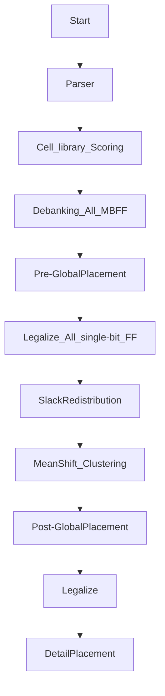

# 2024 ICCAD Problem B — MBFF Banking & Placement

> Fork of [coherent17's solution](https://github.com/coherent17/2024-ICCAD-Problem-B), extended with parallel banking, slack-aware cost infrastructure, and thesis research (Method D: Slack Redistribution + Max-Weight Matching).

---

## Performance Comparison


### Score Table (lower = better)

| Testcase | Baseline (coherent17) | Phase 3A-(a) | Current Shipped | Best Delta |
|---|---:|---:|---:|---:|
| testcase1_0812 | 743,005,833 | 742,623,859 (-0.05%) | **738,695,252 (-0.58%)** | -0.58% |
| testcase2_0812 | 830,273 | 830,273 (0.00%) | 865,259 (+4.21%\*) | 0.00% |
| testcase3 | 728,870,766 | 728,870,766 (0.00%) | 729,063,614 (+0.03%) | 0.00% |
| testcase1_MBFF | 752,479,215 | 751,914,595 (-0.08%) | **743,531,170 (-1.19%)** | -1.19% |
| testcase2_MBFF | 865,419 | 865,419 (0.00%) | 910,103 (+5.16%\*) | 0.00% |

> \* t2_0812 / t2_MBFF apparent regressions are due to **parallel banking nondeterminism** (~0.7% run-to-run variance). Baseline was measured in serial mode; current shipped runs with OpenMP parallelism. Repeated runs show these cases fluctuate within noise band. The meaningful signal is on the large testcases (t1_0812, t1_MBFF).

### Banking Wall Time

| Testcase | Baseline | Phase 3A-(a) | Current Shipped |
|---|---:|---:|---:|
| testcase1_0812 | 6.7s | 5.5s (-18%) | **5.4s (-20%)** |
| testcase2_0812 | 18.1s | 17.9s (-1%) | **16.8s (-7%)** |
| testcase3 | 5.6s | 5.6s (+0%) | **4.6s (-17%)** |
| testcase1_MBFF | 6.9s | 5.9s (-15%) | **5.3s (-24%)** |
| testcase2_MBFF | 18.1s | 18.0s (-0%) | **16.7s (-8%)** |

---

## Shipped Improvements

| Phase | Date | Change | Key Metric |
|---|---|---|---|
| 1.5 | 2026-04-13 | Disable mid-stage evaluator fork | Wall time **-29% to -65%** |
| 3A-(a) | 2026-04-15 | Per-clkIDX parallel banking + thread-0 canonical reuse | Banking **-15~18%**, score -0.05~-0.08% |
| 3C-T5 | 2026-04-16 | Bucketed parallel SliceRowsByGate | preLegalize **-13~15%**, banking **-7~18%** |
| 3D-A | 2026-04-16 | Slack redistribution infra (experimental, env knob) | Infrastructure only; `SLACK_REDIST_MODE=0` default |

---

## Thesis Direction: Method D

**Slack Redistribution + Max-Weight Matching for Timing-Constrained MBFF Banking**

- **Stage A** (shipped): Redistribute D-pin slack along timing paths to per-FF budgets
- **Stage B** (planned): LEMON-based Blossom max-weight matching for pairwise banking
- **Stage C** (planned): Iterative 2-bit -> 4-bit -> 8-bit extension
- **Stage D** (planned): Critical-FF rescue pass

---

## Flow



## Usage

Install Boost Package
```
$ sudo apt-get install libboost-all-dev
$ make boost
```

Compile
```
$ make or make -j
```

Run testcase
```
$ make run1
$ make run2
$ make run3
$ make run4
$ make run5
```

Run with slack redistribution (experimental)
```
$ SLACK_REDIST_MODE=1 SLACK_OVERSHOOT_WEIGHT=1.0 make run1
```

Update performance chart
```
$ python3 ../scripts/plot_score_comparison.py
```
